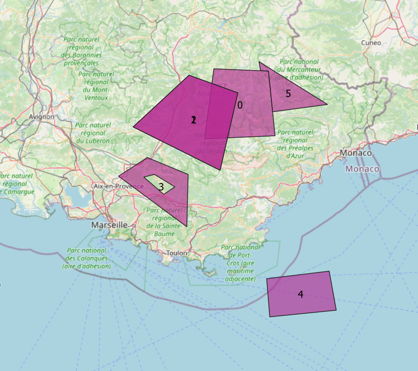

## Guide
Install frictionless_geojson extension

	pip install frictionless_geojson

Install the script (or extension)

### Data
Let's consider this GeoJSON file.

Here is a map of the data :

We can see that :

- 1 and 2 are duplicates
- 1 overlaps 0 (and 2 overlaps 0)
- 4 is overseas

### Schema
And this schema file.

The geographic characteristics are  :

	{
         "name":"geompoint",
         "title":"Point geometry",
         "description":"Point geometry",
         "type":"geojson",
         "geomtype":"point",
         "crs":"EPSG:4326",
         "constraints":{
            "required":true,
            "unique":true,
            "overlaps":false,
            "bounds":[
               4.9283,
               43.0756,
               7.6412,
               45.0923
            ]
         }
      }

### Geovalidate
You can control your file against a schema like this :

	from geovalidate import *	
	geovalidate('../data/example-polygon-invalid.geojson', '../schema.json')

Here is the result :

	File ../outputs/example-polygon-invalid.csv is CSV, so we convert it to GeoJSON
	
	>> Entity  0
	point geometry type is required but Polygon is found
	0 overlaps 1
	0 overlaps 2
	
	>> Entity  1
	point geometry type is required but Polygon is found
	1  equals  2
	1 overlaps 0
	
	>> Entity  2
	point geometry type is required but Polygon is found
	2  equals  1
	2 overlaps 0
	
	>> Entity  3
	point geometry type is required but Polygon is found
	
	>> Entity  4
	point geometry type is required but Polygon is found
	ymin must be superior or equal to ymin bounds
	
	>> Entity  5
	point geometry type is required but Polygon is found

## Checks
Geovalidate provides all these checkings :

- [x] Bounds
- [x] Coordinate Reference System
- [x] Unicity
- [x] Geometry Type
- [x] Overlaps
- [ ] Self Intersections
- [ ] Minimum Area
- [ ] Minimum Length
- [ ] Existence of Geometry
- [ ] Emptiness
- [ ] Allows multiple geometries

Check the reference documentation to see how to implement them in the schema

### Other
They are not checked, but can be specified in the schema, for a good use and knowledge of data.

- [ ] Minimum and Maximum Scale
- [ ] Horizontal Accuracy
- [ ] Source ?

## CSV files with WKT columns
You can also check a CSV file with a WKT column. 

For this, just type :

	from geovalidate import *	
	geovalidate('../data/example-polygon-invalid.csv', '../schema.json')

> Internally, the script will convert the CSV to GeoJSON before inspecting it

