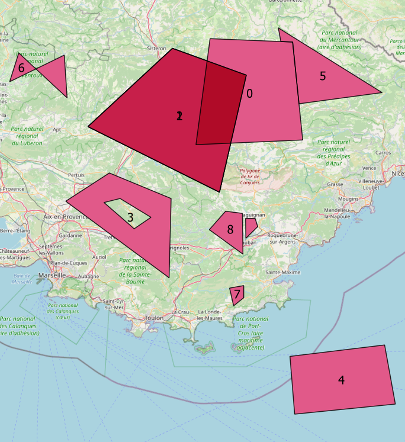

# geo4TablesShema
On OpenData portals, we observe a significative proportion of spatial data.

[TableSchema](https://specs.frictionlessdata.io//table-schema/) is used on [schema.data.gouv.fr](schema.data.gouv.fr) but it misses some specifications for spatial data, and tools for checking and validating spatial dimensions are lacking, which can potentially impact the quality of open geodata.

The purpose of `spatial-schema` is to :

- **suggest new tags** for TableSchema for spatial aspects (geometry types, bounds, coordinate reference system,...)
- **demonstrate with a POC** how spatial controls could be made.

Also, this project follows [cividi frictionless-geojson project](https://github.com/cividi/frictionless-geojson).

## Guide

### Install
- Install python

- Install `frictionless_geojson` extension

		pip install frictionless_geojson

> `frictionless_geojson` will be used further in the POC to convert a GeoCSV into GeoJSON, in order to control the data

### Spatial data
Data in the POC is as CSV (or GeoCSV).

Let's consider [invalid-polygon.csv](invalid-polygon.csv)

If we look inside, there's a column named `_geom` that embeds geometries as WKT (Well-Known-Text). 

Here 	are the first 4 rows of the data file :

fid  |  label                     |  _geom
-----|----------------------------|------------------------------------------------------------------------------------------------------------------------------------------------------------------------------------------------------------------------------------------------------------------------------------------------------------------------------------------------------------------------------------------------
0    |  overlaps 1 and 2          |  POLYGON ((6.2391152188576 44.23331451379951, 6.16161790287912 43.81456334596878, 6.748383295287605 43.83317838644907, 6.727884839005895 43.97646145496493, 6.693028069588689 44.22010833314981, 6.628122911243207 44.22199668957071, 6.2391152188576 44.23331451379951))
1    |  equals 2                  |  POLYGON ((6.032455709581656 44.19521093015088, 5.567471813710779 43.8860751165404, 6.290780096176586 43.62588938560129, 6.438394031373689 44.08970643816957, 6.032455709581656 44.19521093015088))
2    |  equals 1                  |  POLYGON ((6.032455709581656 44.19521093015088, 5.567471813710779 43.8860751165404, 6.290780096176586 43.62588938560129, 6.438394031373689 44.08970643816957, 6.032455709581656 44.19521093015088))
3    |  has a hole                |  POLYGON ((5.685562961868463 43.70225709069182, 5.445690317173171 43.59010057475595, 6.014003967682018 43.28462037694144, 6.025075012821801 43.60079116963337, 5.685562961868463 43.70225709069182), (5.744608535947305 43.60079116963337, 5.914364561423971 43.52591712304841, 5.822105851925783 43.48041248152663, 5.656040174829043 43.58475456510651, 5.744608535947305 43.60079116963337))
4    |  is outside                |  POLYGON ((7.198605797638769 43.0153859029196, 6.678266676068982 42.96949811360918, 6.704099114728473 42.73683492429429, 7.257651371717611 42.77747881636348, 7.198605797638769 43.0153859029196))

Also, the last two rows do not contain geometries

| fid | label | _geom |
| -- | -- | -- |
| 9 | No geometry | |
| 10 | No geometry | |

The `label` column gives the nature of the errors.

Here's a map of the data (you can get it as a geojson [here](data/geojson/invalid-polygon.geojson)) :



We can see that :

- 1 and 2 are **duplicates**
- 1 **overlaps** 0
- 2 **overlaps** 0
- 4 is **outside** the data extent
- 6 is **not valid**, as it has a self-intersection
- 7 is **too small**

### Schema
Let's consider the [schema-polygon.json](schema-polygon.json) schema file.

Inside, geographic specifications are mentioned like this  :

```json
{
	 "name":"_geom",
	 "title":"Polygon geometry",
	 "description":"Polygon geometry",
	 "type":"wkt",
	 "geomtype":"polygon",
	 "crs":"EPSG:4326",
	 "horizontalAccuracy":5,
	 "constraints":{
	    "required":true,
	    "unique":true,
	    "overlaps":false,
	    "minArea":100000000,
	    "bounds":[
	       4.9283,
	       43.0756,
	       7.6412,
	       45.0923
	    ]
	 }
}
```

You can see all the news that have been added to TableSchema : the `wkt` type, `geomtype`, `crs`, `overlaps`, `minArea`, `bounds`

You can see that the geometry column must be named `_geom` and here are the corresponding requirements, reading this schema :

- Data MUST be in `WGS84`
- Rows MUST contain geometries
- Geomtries MUST be of `Polygon` type
- Geometries MUST be unique
- Geometries MUST NOT overlap
- Geometries MUST be at least 100000000 square meters
- Geometries MUST be inside the `[4.9283, 43.0756, 7.6412, 45.0923]` bounding box.

### Geovalidate
- We have the data : [`invalid-polygon.csv`](invalid-polygon.csv)
- And the schema : [`schema-polygon.json`](schema-polygon.json)

#### Command line
We can control our data against the schema (check [`geovalidate.bat`](geovalidate.bat)) :

	python geovalidate.py invalid-polygon.csv schema-polygon.json

Here is the result :
	
	File : invalid-polygon.csv
	
	Geometry column : '_geom' is the geometry column according to the schema
	
	Analyzing '_geom' column...
	
	[Warning] 2 rows without geometries were found : 9, 10.
	
	0 : overlaps 1
	0 : overlaps 2
	1 : equals 2
	1 : overlaps 0
	2 : equals 1
	2 : overlaps 0
	4 : ymin too low. ymin (42.736835) is inferior to ymin bounds (43.075600)
	6 : geometry is not valid
	7 : area too small. It is smaller than 100000000 square meters
	8 : geometry is not valid
	9 : no geometry
	10 : no geometry

### Python
In python, you can control data like this :

```python
from geovalidate import *	
geovalidate('../data/invalid-polygon.csv', 'schema-polygon.json')
```

[`f_geovalidate.py`](f_geovalidate.py) contains all the functions required to run the controls.

## Checkings
For the moment, `geovalidate` provides [all these checkings](mds/CHECKS)

## Examples
You can check [BATCH-EXAMPLES](mds/BATCH-EXAMPLES.md) to have more examples on running various checks.

## Documentation
Also, you can can check the [REFERENCE page](mds/REFERENCE) to have to the proposal of the spatial specifications.

